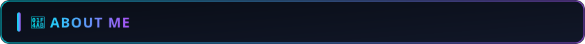
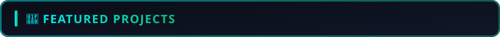

  <!-- Hero Banner Card (Cyber Octagon Avatar & Floating Animations) -->
  

    

  <!-- Animated Typing SVG -->
  

  

    
    
    
    
  

  

    
    
    
  

 

<!-- SECTION 1: ABOUT ME -->

  

  

 

<!-- SECTION 2: CURRENT EXPERIENCE -->

  

<table width="100%">
  <tr>
    <td width="70px" align="center" style="background-color: #0b0f19;">
      
    </td>
    <td style="background-color: #0b0f19; padding: 16px;">
      <h3 style="margin: 0; color: #00F2FE;">Software Engineer Intern · Invictus Tec</h3>
      📅 Aug 2026 – Present · 🌐 Remote · 
        
      <ul style="color: #cbd5e1; margin-bottom: 0;">
        <li>🚀 <strong>Full-Stack Architecture:</strong> Developing real-world scalable full-stack web applications using MERN & PERN stacks.</li>
        <li>⚡ <strong>Agile & Optimization:</strong> Collaborating on modern agile workflows, performance tuning, and scalable API design.</li>
      </ul>
    </td>
  </tr>
</table>

 

<!-- SECTION 3: TECH STACK & SKILLS -->

  

  <h4>🌐 Frontend Development</h4>
  

    
    
    
    
  

  <h4>⚙️ Backend & APIs</h4>
  

    
    
    
  

  <h4>🗄️ Databases & Cloud Storage</h4>
  

    
    
    
  

  <h4>🤖 AI & Prompt Engineering</h4>
  

    
    
    
    
  

  <h4>💻 Languages & Development Tools</h4>
  

    
    
    
    
    
    
  

 

<!-- SECTION 4: FEATURED PROJECTS -->

  

<table width="100%">
  <tr>
    <td width="50%" valign="top" style="padding: 12px;">
      

        
        <h3 style="margin: 4px 0; color: #00F2FE;">🎮 CarePlay</h3>
        
<em>AI-Based Social Impact Mobile App</em>

         
        
        
      

      
Innovative mobile platform where interactive gaming mechanics generate funding and support for patients facing critical healthcare expenses.

      <ul>
        <li>Interactive fundraising game integration</li>
        <li>Full-stack backend architecture with MongoDB Atlas</li>
      </ul>
      
<strong>Tech:</strong> <code>React</code> · <code>Node.js</code> · <code>Express.js</code> · <code>MongoDB Atlas</code>

    </td>
    <td width="50%" valign="top" style="padding: 12px;">
      

        
        <h3 style="margin: 4px 0; color: #00F2FE;">🏥 Physio Assessment App</h3>
        
<em>SAAI Physiotherapy Hospital</em>

         
        
        
      

      
Hospital management & physiotherapy assessment application enabling online appointment scheduling and structured patient health tracking.

      <ul>
        <li>End-to-end appointment scheduling</li>
        <li>Secure patient records management</li>
        <li>Published on Google Play Store</li>
      </ul>
      
<strong>Tech:</strong> <code>React.js</code> · <code>Node.js</code> · <code>PostgreSQL</code>

    </td>
  </tr>
  <tr>
    <td width="50%" valign="top" style="padding: 12px;">
      

        
        <h3 style="margin: 4px 0; color: #00F2FE;">👥 Peer-to-Peer Learning</h3>
        
<em>Collaborative EdTech Platform</em>

         
        
        
      

      
A collaborative ecosystem allowing students and developers to share technical resources, mentor each other, and grow together.

      <ul>
        <li>Community resource hub & discussions</li>
        <li>Real-time peer interaction & notes sharing</li>
      </ul>
      
<strong>Tech:</strong> <code>React.js</code> · <code>Node.js</code> · <code>Express.js</code> · <code>MongoDB</code>

    </td>
    <td width="50%" valign="top" style="padding: 12px;">
      

        
        <h3 style="margin: 4px 0; color: #00F2FE;">💼 HR Management System</h3>
        
<em>IGEN Services & Solutions</em>

         
        
        
      

      
Streamlined talent acquisition and human resource management platform designed to automate recruitment pipelines and applicant tracking.

      <ul>
        <li>Candidate pipeline & resume screening</li>
        <li>Interview scheduling and onboarding flow</li>
      </ul>
      
<strong>Tech:</strong> <code>React.js</code> · <code>Node.js</code> · <code>PostgreSQL</code>

    </td>
  </tr>
</table>

 

<!-- SECTION 5: EDUCATION & HONORS -->

  

<table width="100%">
  <tr>
    <td style="background-color: #0b0f19; padding: 16px;">
      <h4 style="margin: 0; color: #00F2FE;">🎓 B.Tech in Information Technology | 2025 – 2028</h4>
      
🏛️ <strong>Nandha Engineering College, Erode</strong> · 

      

      <h4 style="margin: 0; color: #a855f7;">📜 Diploma in Computer Science | Graduated 2025</h4>
      
🏛️ <strong>SSM Polytechnic College, Komarapalayam</strong> · 

      
🏆 <strong>Award: Best Outgoing Student Award (Diploma) — 2025</strong>

    </td>
  </tr>
</table>

 

<!-- SECTION 6: GITHUB ANALYTICS -->

  

  

    
    
  

  

    
  

 

<!-- SECTION 7: LET'S CONNECT -->

  

  
I'm always excited to collaborate on open-source projects, AI applications, and full-stack innovations.

  
  
  
  

    
  

